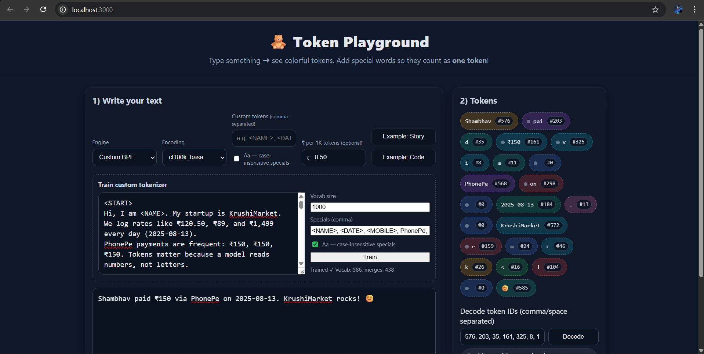
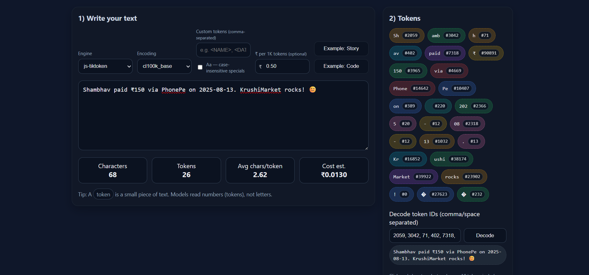

# 🧸 Token Playground

Interactive playground + CLI to **tokenize, decode, and train a Custom BPE tokenizer**.  
Front-end lets you compare **js-tiktoken** encodings with your **Custom BPE** model, visualize tokens with IDs, and estimate cost per 1K tokens.

Repository: https://github.com/manojhogale/token-playground

---

## ✨ Features

- **Two engines**
  - **js-tiktoken**: use OpenAI-style encodings (`cl100k_base`, etc.) with support for *custom one-token specials*.
  - **Custom BPE**: train your own tokenizer from text (vocab size + specials), then encode/decode live.
- **Visual token grid** with color chips + `#id` per token.
- **Cost estimator** (₹ per 1K tokens) that updates as you type.
- **Decode tool**: paste token IDs → get back text.
- **CLI** for encode/decode/analyze + tests.

> **UX note (as per screenshot):**  
> When **Engine = Custom BPE**, the “2) Tokens” card **moves below** the editor (full width).  
> For other engines, layout stays **two columns**.

---

## 🚀 Quick Start

```bash
git clone https://github.com/manojhogale/token-playground.git
cd token-playground
npm install
npm start
```

Open http://localhost:3000

### CLI

```bash
# Encode text
node cli.js encode "Shambhav paid ₹150 via PhonePe."

# Decode IDs (comma/space separated)
node cli.js decode "576, 203, 35, 161, 325, 8, 1"
```

### Tests

```bash
npm test
```

---

## 🖥️ Web Demo — What each control does

### 1) Engine
- **js-tiktoken** → uses `cl100k_base` (or selected encoding).
- **Custom BPE** → shows a **Train** panel and switches layout to **single column** so tokens appear **below**.

### 2) Encoding (js-tiktoken only)
- Pick from `cl100k_base`, `o200k_base`, `p50k_base`, `r50k_base`, `gpt2` (loaded from `/api/encodings`).

### 3) Custom tokens (js-tiktoken only)
- Comma-separated list that should count as **one token** even if the base encoding would split them.  
  Example: `<NAME>, <DATE>, 😊, PhonePe`
- **Aa — case-insensitive specials** → If enabled, the app expands the list to lower/UPPER/Title variants so `PhonePe`, `PHONEPE`, `phonepe` all match **one token**.

### 4) ₹ per 1K tokens
- Optional. If set, we compute **Cost est.** = `(tokens / 1000) × price`.

### 5) Train custom tokenizer (Custom BPE)
- **Text area**: paste a small corpus (a few paragraphs is fine).
- **Vocab size**: try **800–1200** for demos. Smaller = merges become obvious.
- **Specials (comma)**: e.g. `<NAME>, <MOBILE>, PhonePe, KrushiMarket, Shambhav, 😊`
- **Aa — case-insensitive specials**: same idea as above; `Shambhav/SHAMBHAV/shambhav` collapse to **one token**.
- Click **Train** → status shows `Trained ✓  Vocab: N, merges: M`.

### 6) Editor
- Type anything; spaces and emojis matter. We render a **small dot** before tokens that start with a leading space (equivalent to the ▁ behavior).

### 7) Stats
- **Characters**, **Tokens**, **Avg chars/token**, **Cost est.** (if price set).

### 8) 2) Tokens (chips on the right / bottom)
- Each chip shows **text** + **`#id`**.
- Colors are stable per id (hash-based), so repeated tokens are easy to spot.

### 9) Decode token IDs
- Paste IDs like: `576, 203, 35, 161, 325, 8, 1` → **Decode** → original text appears.

---

## 📸 Screenshots

> Put images into `docs/` and commit them. Example names below.

- 
- 

- 


---

## 🧪 Ready-to-use Demo Data

### Sample **Train Text** (paste into *Train custom tokenizer*)
```text
<START>
Hi, I am <NAME>. My startup is KrushiMarket. We log rates like ₹120.50, ₹89, and ₹1,499 every day (2025-08-13).
PhonePe payments are frequent: ₹150, ₹150, ₹150. Tokens matter because a model reads numbers, not letters.

Shambhav built a tokenizer. shambhav tested the Tokenizer. SHAMBHAV optimized token merges.
Goal: "Shambhav" (any case) should act as one special token.

Common patterns we see:
- Dates: 2025-08-01, 2025-08-02, 2025-08-03
- Mobiles: <MOBILE>, +91-98765-43210, 9876543210
- Order IDs: ORD-2025-0001, ORD-2025-0002, ORD-2025-0003
- Cities: Pune, Mumbai, Nashik, Pune, Mumbai, Pune

Hinglish/Marathi/Hindi mix:
Aaj market rates update kele. KrushiMarket app madhun farmers la live bhaav disato.
Kal PhonePe varun ₹150 receive zhale. Aaj Doraemon story sarkha simple explain kela:
“GPT ek word-robot aahe jo pudhcha shabda andajane lihito.”
बच्चों को समझाने के लिए हम emojis वापरतो: 😊 😊 😊

Repeated phrases for BPE:
"token", "token", "token", "tokenizer", "tokenizer", "tokenization", "merge pairs", "merge pairs", "merge pairs".
"KrushiMarket KrushiMarket KrushiMarket"
"PhonePe PhonePe PhonePe"

Some code (patterns & comments):
function add(a, b) { return a + b; } // add add add
const price = 150; // ₹150
console.log("tokenize -> decode -> same text?");
let text = "<NAME> paid ₹150 via PhonePe on 2025-08-13.";
// URLs/usernames-like:
user@domain.com, https://example.com/api/encode, @shambhav_dev

JSON-ish logs:
{"event":"rate_update","commodity":"Tur","price":"₹120.50","date":"2025-08-13"}
{"event":"rate_update","commodity":"Soybean","price":"₹89.00","date":"2025-08-13"}
{"event":"payment","mode":"PhonePe","amount":"₹150","user":"<NAME>"}

Whitespace & punctuation checks:
   multiple   spaces   preserved. Tabs\tand\nnewlines\nare here.
Emojis: 😊 🤝 🚜 🌾  😊  😊

End with a small paragraph repeated to force merges:
KrushiMarket helps farmers. KrushiMarket helps farmers. KrushiMarket helps farmers.
Token playground shows colorful tokens. Token playground shows colorful tokens. Token playground shows colorful tokens.
<END>
```

**Specials (comma):**
```
<NAME>, <DATE>, <MOBILE>, PhonePe, KrushiMarket, Shambhav, Token, Tokenizer, 😊
```

**Vocab size:** `1000`  
**Checkbox:** ✅ *Aa — case-insensitive specials*

### Quick check (type in Editor)
```
Shambhav paid ₹150 via PhonePe on 2025-08-13. KrushiMarket rocks! 😊
```
Expected: `Shambhav`, `PhonePe`, `KrushiMarket`, `😊` become **single tokens**; rest are BPE splits.  
You’ll see token chips with ids similar to your screenshots (ids depend on training).

---

## 🔌 API used by the Front-end

- `GET /api/encodings` → `{ encodings: [...], defaultPriceInrPerK: {...} }`
- `POST /api/tokenize` (js-tiktoken)
  - Body: `{ text, encodingName, customTokens }`
  - Returns: `{ counts, items, tokenIds }`
- `POST /api/decode` (js-tiktoken)
  - Body: `{ tokenIds, encodingName }`
  - Returns: `{ text }`
- `POST /api/custom/train`
  - Body: `{ text, vocabSize, specials }`
  - Returns: `{ ok, vocabSize, merges }`
- `POST /api/custom/encode`
  - Body: `{ text }`
  - Returns: `{ counts, items, tokenIds }`
- `POST /api/custom/decode`
  - Body: `{ tokenIds }`
  - Returns: `{ text }`

> Front-end adds case variants automatically if “Aa — case-insensitive specials” is checked.

---

## 🧰 CLI Usage (examples)

```bash
# Encode with current default encoding/specials
node cli.js encode "PhonePe PhonePe PhonePe 😊"

# Decode a list of IDs
node cli.js decode "9906, 602, 1097, 893"

# Analyze file (token count + avg chars/token)
node cli.js analyze ./samples/story.txt
```

---

## 🧠 Notes & Tips

- **Spaces & dots:** a light dot before a chip indicates the token had a leading space (like ▁ in SentencePiece).
- **Emojis:** treated as Unicode scalars—can be single tokens if present in vocab/specials.
- **IDs differ** between engines. js-tiktoken uses fixed vocab; Custom BPE produces ids based on your training.
- **Case-insensitive specials** are expanded to lower/UPPER/Title internally so any case matches one token.

---

## 🐞 Troubleshooting

- **“Please train first” / empty tokens in Custom BPE**  
  Paste train text, set vocab/specials, click **Train**, then **type** or click an example.
- **My special isn’t one token**  
  - Check it’s in **Specials** (or **Custom tokens** for js-tiktoken).
  - Enable **Aa** if you need case-insensitive match.
  - Re-train if using Custom BPE.
- **Cost shows —**  
  Set **₹ per 1K tokens** to enable the estimator.

---

## 📂 Suggested Structure

```
token-playground/
├─ public/
├─ src/
│  ├─ server/ (encodings, custom bpe trainer/encoder/decoder)
│  └─ web/ (this UI)
├─ docs/
│  ├─ token-playground-1.png
│  └─ token-playground-2.png
│  └─ token-playground-3.png
├─ cli.js
└─ README.md
```
